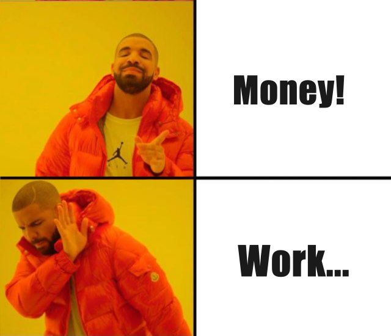
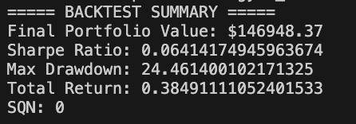

# InvestAI

<div align="center">
   
   <p> If AI’s taking your job, let it fund your freedom. </p>
</div>

## Inspiration

AI is powerful—we’ve all imagined a future where it helps us work while we just collect the paycheck. But if our ultimate goal is financial freedom, why stop there? Why not let AI skip the "work" altogether and go straight to making money for us? That’s the vision behind InvestAI: an autonomous agent that continuously adapts its trading strategies to follow market trends and profit directly from price movements—no job required.

## What it does

InvestAI generates algorithmic trading strategies for any stock you choose—and continuously updates them to adapt to market trends. It stays rational, processes massive amounts of data, filters out noise, and extracts the most valuable and truthful insights to help you make smarter investments.

Got your own trading idea? InvestAI can iterate, verify, and evaluate it within an hour. Experience is no longer required—AI helps you capture the probabilities hidden in every possible outcome.

## Accomplishments that we're proud of

We’ve proven that when you trust AI and give it time, it can discover profitable strategies for virtually any stock. In just two hours, InvestAI was able to generate a strategy that projects an annual return of nearly 20%. All we had to do was let the AI explore, experiment, and optimize—then come back to see the results.

<div align="center">
   
</div>

## What's next for InvestAI

Next, we plan to expand the range of tradable assets and increase the trading frequency. This will give InvestAI more flexibility to explore diverse opportunities and generate more innovative, adaptive, and stable strategies. The goal: reduce risk, boost returns, and grow your wealth with even greater confidence.

## Getting Started: Development and Local Testing

Follow these steps to get the application running locally for development and testing.

**1. Prerequisites:**

-   Node.js and npm (or yarn/pnpm)
-   Python 3.11+
-   **`GEMINI_API_KEY`**: The backend agent requires a Google Gemini API key.
    1.  Navigate to the `backend/` directory.
    2.  Create a file named `.env` by copying the `backend/.env.example` file.
    3.  Open the `.env` file and add your Gemini API key: `GEMINI_API_KEY="YOUR_ACTUAL_API_KEY"`

**2. Install Dependencies:**

**Backend:**

```bash
cd backend
pip install .
```

**Frontend:**

```bash
cd frontend
npm install
```

**3. Run Development Servers:**

**Backend & Frontend:**

```bash
make dev
```

This will run the backend and frontend development servers. Open your browser and navigate to the frontend development server URL (e.g., `http://localhost:5173/app`).

_Alternatively, you can run the backend and frontend development servers separately. For the backend, open a terminal in the `backend/` directory and run `langgraph dev`. The backend API will be available at `http://127.0.0.1:2024`. It will also open a browser window to the LangGraph UI. For the frontend, open a terminal in the `frontend/` directory and run `npm run dev`. The frontend will be available at `http://localhost:5173`._

## How the Backend Agent Works (High-Level)

The core of the backend is a LangGraph agent defined in `backend/src/agent/graph.py`. It follows these steps:


1.  **Generate Initial Queries:** Based on your input, it generates a set of initial search queries using a Gemini model.
2.  **Web Research:** For each query, it uses the Gemini model with the Google Search API to find relevant web pages.
3.  **Reflection & Knowledge Gap Analysis:** The agent analyzes the search results to determine if the information is sufficient or if there are knowledge gaps. It uses a Gemini model for this reflection process.
4.  **Iterative Refinement:** If gaps are found or the information is insufficient, it generates follow-up queries and repeats the web research and reflection steps (up to a configured maximum number of loops).
5.  **Finalize Answer:** Once the research is deemed sufficient, the agent synthesizes the gathered information into a coherent answer, including citations from the web sources, using a Gemini model.

## CLI Example

For quick one-off questions you can execute the agent from the command line. The
script `backend/examples/cli_research.py` runs the LangGraph agent and prints the
final answer:

```bash
cd backend
python examples/cli_research.py "What are the latest trends in renewable energy?"
```

## Deployment

In production, the backend server serves the optimized static frontend build. LangGraph requires a Redis instance and a Postgres database. Redis is used as a pub-sub broker to enable streaming real time output from background runs. Postgres is used to store assistants, threads, runs, persist thread state and long term memory, and to manage the state of the background task queue with 'exactly once' semantics. For more details on how to deploy the backend server, take a look at the [LangGraph Documentation](https://langchain-ai.github.io/langgraph/concepts/deployment_options/). Below is an example of how to build a Docker image that includes the optimized frontend build and the backend server and run it via `docker-compose`.

_Note: For the docker-compose.yml example you need a LangSmith API key, you can get one from [LangSmith](https://smith.langchain.com/settings)._

_Note: If you are not running the docker-compose.yml example or exposing the backend server to the public internet, you should update the `apiUrl` in the `frontend/src/App.tsx` file to your host. Currently the `apiUrl` is set to `http://localhost:8123` for docker-compose or `http://localhost:2024` for development._

**1. Build the Docker Image:**

Run the following command from the **project root directory**:

```bash
docker build -t gemini-fullstack-langgraph -f Dockerfile .
```

**2. Run the Production Server:**

```bash
GEMINI_API_KEY=<your_gemini_api_key> LANGSMITH_API_KEY=<your_langsmith_api_key> docker-compose up
```

Open your browser and navigate to `http://localhost:8123/app/` to see the application. The API will be available at `http://localhost:8123`.

## Technologies Used

-   [React](https://reactjs.org/) (with [Vite](https://vitejs.dev/)) - For the frontend user interface.
-   [Tailwind CSS](https://tailwindcss.com/) - For styling.
-   [Shadcn UI](https://ui.shadcn.com/) - For components.
-   [LangGraph](https://github.com/langchain-ai/langgraph) - For building the backend research agent.
-   [Google Gemini](https://ai.google.dev/models/gemini) - LLM for query generation, reflection, and answer synthesis.

## License

This project is licensed under the Apache License 2.0. See the [LICENSE](LICENSE) file for details.
